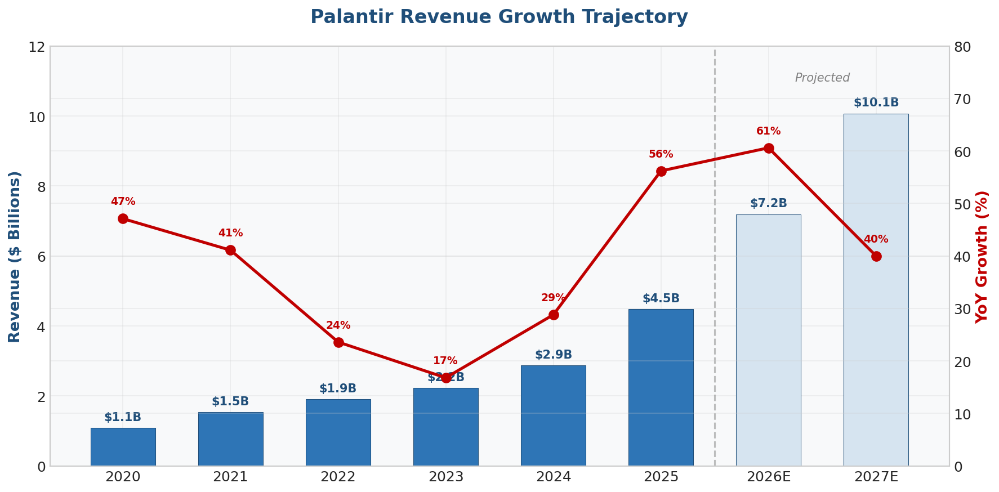
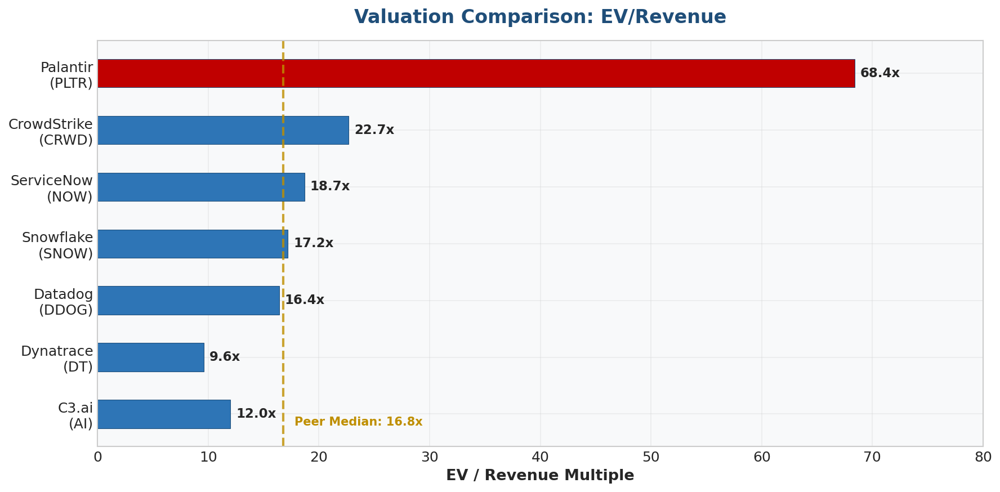
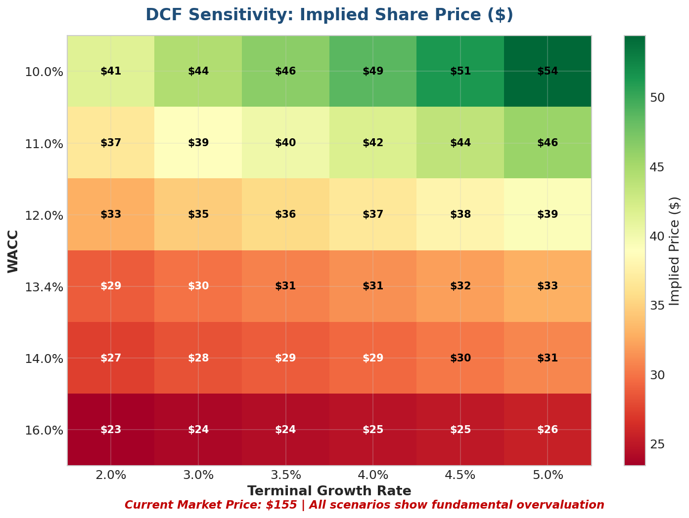
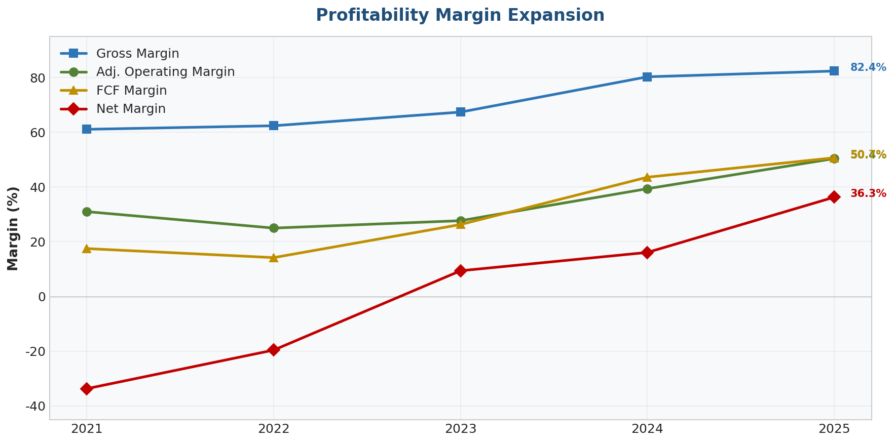

# AI Equity Research Analyst 📈

**A submission for the [Manus](https://manus.im/) × [Vibecoding](https://www.linkedin.com/in/johnathankwok/) Consulting AI Hackathon**

Give it a ticker symbol. Get a complete investment memo.

This project automates the end-to-end workflow of equity research analysis using [Manus](https://manus.im/) as the core platform. From a single ticker input (e.g., `PLTR`), it autonomously collects financial data, reads SEC filings, builds a valuation model, and produces three professional, editable deliverables — all in about **20 minutes**.

---

## 📊 Demo: Palantir (PLTR) — What the Tool Produces

Here's a taste of what the pipeline generated in 20 minutes for Palantir Technologies:

### The Recommendation

> **HOLD** — Palantir's execution is exceptional (FY2025 revenue of $4.48B, up 56% YoY; Rule of 40 score of 127%; FCF margin of 50.7%), but the stock is priced for absolute perfection. Trading at ~68x EV/Revenue — roughly 4x the peer median — the current ~$155 price requires sustaining 60%+ growth for 5+ years while maintaining 50%+ margins, a historically unprecedented feat. Our DCF implies a fundamental fair value of **$31.37/share**. Aggressive insider selling ($292M in 30 days, zero purchases) reinforces caution.

**How Manus reached this conclusion:**
1. **The Business:** Manus pulled the latest financials from SEC filings and saw an incredible business — revenue growing fast, massive cash flow, flawless execution.
2. **The Valuation:** But then it asked if the $155 stock price was justified. It built a DCF model estimating the company's worth based on future earnings, arriving at ~$31. The market is demanding 60% growth for the next five years straight — something almost no company in history has done.
3. **The Insider Signal:** Manus then scraped insider trading data via Yahoo Finance API (`get_stock_insider_roster` and `get_stock_insider_transactions`) and found executives had sold nearly $300 million in stock over 30 days, with zero buys.
4. **The Verdict:** Instead of hyping the AI narrative, Manus issued a data-driven 'Hold' — concluding the company is great, but the stock is priced for absolute perfection.

### Sample Charts

| Revenue Growth Trajectory | Valuation vs. Peers |
|:---:|:---:|
|  |  |

| DCF Sensitivity Heatmap | Profitability Expansion |
|:---:|:---:|
|  |  |

### The Three Deliverables

| Deliverable | Description |
|---|---|
| **Investment Memo Slides** | 12-slide presentation with executive summary, business model, financials, valuation, bull/bear case, and recommendation |
| **Financial Model (Excel)** | Multi-sheet workbook: Income Statement, Balance Sheet, DCF Valuation, Comparable Company Analysis, Key Metrics |
| **Research Report (PDF)** | 15+ page detailed write-up with all findings, sources cited, and actionable recommendation |

All outputs are available in the [`demo/`](demo/) folder.

---

## 🎯 The Problem

Investment banks, private equity firms, and hedge funds pay junior analysts $100K–$200K+ to spend 20–40 hours per week on a repetitive cycle: pull financial data from terminals, read through SEC filings, update Excel models, draft investment memos, and format slide decks. Every new stock, every earnings cycle, the same grind repeats.

**This project automates that entire cycle.**

**Target User:** Equity Research Analysts, PE/VC Associates, Strategy Consultants, Portfolio Managers, and anyone who needs to go from "I want to look at this stock" to "Here's my recommendation" without spending a week on it.

---

## 📦 What's in This Repo

```
manus-equity-research/
├── README.md                              # You're reading it
├── prompt.md                              # Copy-paste Manus prompt (works for any ticker)
├── skill/                                 # Reusable Manus Skill
│   ├── SKILL.md                           # 8-phase workflow engine
│   ├── scripts/
│   │   ├── fetch_financials.py            # Yahoo Finance API data fetcher
│   │   ├── build_financial_model.py       # Excel financial model builder (openpyxl)
│   │   └── generate_charts.py             # Chart generator (matplotlib)
│   ├── templates/
│   │   └── investment_memo_template.md    # Report structure template
│   └── references/
│       ├── data_sources.md                # Data collection checklist
│       └── slide_structure.md             # Slide design guidelines
├── demo/                                  # PLTR demo outputs
│   ├── PLTR_Investment_Memo.md            # Full research report (Markdown)
│   ├── PLTR_Investment_Memo.pdf           # PDF version
│   ├── PLTR_Financial_Model.xlsx          # Excel model (DCF, comps, income statement)
│   ├── charts/                            # Generated visualizations
│   └── slides/                            # Presentation HTML slides
```

---

## 🚀 How to Use It

**Option A — The Prompt (quickest)**
1. Open a new [Manus](https://manus.im/) session.
2. Copy the contents of [`prompt.md`](prompt.md).
3. Replace `[INSERT TICKER HERE]` with any U.S.-listed ticker (e.g., `SNOW`, `CRWD`, `CRM`).
4. Paste and hit enter. Wait ~20 minutes.

**Option B — The Skill (reusable)**
1. Import the `skill/` folder into your Manus skills directory.
2. Prompt: *"Run an equity research analysis on SNOW using the /equity-research-analyst skill."*

Both options produce the same three deliverables.

---

## ⚙️ Analyst on Autopilot: How Manus Was Used

This isn't a ChatGPT wrapper. Manus orchestrates a complex, multi-tool, multi-source pipeline that mirrors exactly what a human analyst does — but in 20 minutes instead of 20 hours.

### The Toolkit (What's Under the Hood)

| Tool / Technology | What It Actually Does | Specific Use in This Pipeline |
|---|---|---|
| **Yahoo Finance API** (`get_stock_profile`, `get_stock_financial_data`, `get_stock_what_analyst_recommend`, `get_stock_holders`, `get_stock_insights`, `get_stock_sec_filing`, `get_stock_chart`) | Free REST API endpoints that return structured JSON data on any public stock | Pulls market cap, P/E ratio, analyst Buy/Hold/Sell ratings, insider transactions, institutional holders, SEC filing links, and 5-year price history |
| **Web Browser (Chromium)** | A real headless browser that navigates pages, reads content, and extracts data | Browses SEC EDGAR to read 10-K/10-Q filings and earnings releases; visits Macrotrends for historical financials |
| **Firecrawl MCP** | An advanced web scraping server that extracts structured data from complex pages | Scrapes financial tables, analyst consensus data, and insider transaction records |
| **Python (`openpyxl`)** | Python library for creating and manipulating Excel files programmatically | Builds the multi-sheet `.xlsx` financial model with formatted cells, formulas, and conditional formatting |
| **Python (`matplotlib`)** | Python charting library for publication-quality visualizations | Generates revenue growth charts, valuation comparison bars, and DCF sensitivity heatmaps as PNG files |
| **Python (`pandas`)** | Data manipulation and analysis library | Cleans, transforms, and structures all financial data before modeling |
| **Manus Slides Engine** | Native slide generation tool that renders HTML-based presentations directly in the Manus UI | Builds the 12-slide investment memo deck with embedded charts and professional styling |
| **AI Image Generator** | Generates images from text descriptions | Creates the professional cover image for the slide deck |
| **Markdown + PDF Converter** (`manus-md-to-pdf`) | Converts Markdown documents to formatted PDF | Produces the final PDF version of the research report |
| **Shell / File System** | Linux command line for orchestration | Manages the project directory, runs scripts, installs dependencies, and coordinates the entire pipeline |

### The Pipeline (Step by Step)

```
User Input: "PLTR"
       │
       ▼
┌─────────────────────────┐
│  1. Yahoo Finance API   │ ──→ Market data, analyst ratings, insider trades, SEC filing links
│     + Web Browser       │ ──→ SEC EDGAR filings, earnings releases, historical financials
│     + Firecrawl MCP     │ ──→ Structured scraping of financial tables
└─────────────────────────┘
       │
       ▼
┌─────────────────────────┐
│  2. Python              │ ──→ DCF model, comps analysis, Excel workbook (.xlsx)
│  (openpyxl, pandas,     │ ──→ Revenue charts, valuation comps, sensitivity heatmap (.png)
│   matplotlib)           │
└─────────────────────────┘
       │
       ▼
┌─────────────────────────┐
│  3. AI Image Generator  │ ──→ Cover art for the slide deck
│  + Manus Slides Engine  │ ──→ 12-slide investment memo presentation
│  + Markdown + PDF       │ ──→ Research report (.md + .pdf)
└─────────────────────────┘
       │
       ▼
  Final Deliverables:
  • Investment Memo Slides (rendered in Manus UI)
  • Financial Model (.xlsx) — editable in Excel / Google Sheets
  • Research Report (.md + .pdf)
```

### Phase 1: Data Collection & Research (~8-10 mins)

Manus writes and executes a Python script that calls 7 Yahoo Finance API endpoints to pull structured JSON data — everything from the company profile and market cap to analyst Buy/Hold/Sell ratings and insider transactions. It then opens a Chromium browser to navigate directly to SEC EDGAR, where it reads the company's most recent earnings release and 10-K filing, extracting revenue by segment, margin trends, cash flow, and management guidance. Finally, it researches the competitive landscape, TAM (Total Addressable Market), and macro context through web search.

Here's what Manus was actually thinking during this phase (from the live activity log):

> *"I confirmed the project structure is set; now focusing on finding Palantir's latest financial data, revenue, earnings, and key metrics to support data collection in phase one."*
>
> *"I found recent analyst ratings, price targets, and insider trading activity for Palantir. I also developed and executed a script to fetch the latest financial data."*
>
> *"Found recent bearish technical outlook, overvaluation, and insider sales, indicating cautious sentiment. Next, reviewing detailed financials to assess valuation and performance."*
>
> *"Recent financials show Palantir's Q4 2025 revenue grew 70% YoY, with strong US commercial and government growth."*
>
> *"I learned Palantir's products — Gotham for government and Foundry for enterprise — are highly customizable, leveraging AI/ML, Ontology, and AIP to build scalable, integrated data solutions with strong government and commercial momentum."*

### Phase 2: Financial Modeling & Deliverable Generation (~10-12 mins)

Manus writes and executes Python scripts to build the financial model, generate charts, write the research report, and create the slide deck. The most interesting part is the DCF model — Manus iteratively debugged its own calculations:

> *"Adjusted WACC to 13.4% by lowering beta to 1.65, improving valuation accuracy. Re-running the model to refine the implied price and sensitivity analysis."*
>
> *"By fixing units, extending projections, and adjusting growth assumptions, the model still yields an implied price around $31, confirming the significant valuation gap with the current $155."*
>
> *"I verified the DCF calculation; fair value is about $31, confirming the stock is overvalued at $155."*

This self-correction loop — writing code, running it, spotting an issue, fixing it, and re-running — is exactly what a human analyst does. Manus did it autonomously.

**Total wall-clock time: ~20 minutes** from ticker input to three complete deliverables.

---

## 🔑 Key Finance Terms (For Non-Finance Readers)

If you're not from a finance background, here's a quick glossary of the terms used in the outputs:

| Term | What It Means (Plain English) |
|---|---|
| **DCF (Discounted Cash Flow)** | A way to figure out what a company is worth today based on how much cash it's expected to generate in the future. Think of it as: "If this company will make $X over the next 10 years, what's that worth in today's dollars?" |
| **WACC (Weighted Average Cost of Capital)** | The minimum return a company needs to earn to satisfy its investors. It blends the cost of debt (loans) and equity (stock). A higher WACC means the company is riskier, which lowers its valuation. |
| **CAPM (Capital Asset Pricing Model)** | A formula to calculate the expected return on a stock. It uses the risk-free rate (government bond yield), the stock's beta (volatility), and the equity risk premium (extra return investors demand for stocks vs. bonds). |
| **EV/Revenue (Enterprise Value to Revenue)** | A valuation ratio. If a company has an EV/Revenue of 10x, investors are paying $10 for every $1 of annual revenue. Higher = more expensive. |
| **Rule of 40** | A benchmark for software companies: revenue growth rate + profit margin should exceed 40%. A score of 127% (like Palantir's) is exceptional. |
| **FCF (Free Cash Flow)** | The cash a company generates after paying for everything it needs to operate. This is the "real money" left over for investors. |
| **Beta** | How volatile a stock is compared to the overall market. A beta of 1.65 means the stock moves 65% more than the market — higher risk, higher potential reward. |
| **Terminal Value** | In a DCF model, you can't project cash flows forever. Terminal value estimates what the company is worth beyond the projection period (usually 10 years). |
| **Comps (Comparable Company Analysis)** | Comparing a company's valuation multiples against similar companies to see if it's cheap or expensive relative to peers. |
| **SBC (Stock-Based Compensation)** | When companies pay employees with stock instead of cash. It's a real cost that dilutes existing shareholders, but it doesn't show up as a cash expense. |

---

## 🎯 How Competitors Are Selected

A key part of any equity research analysis is the **Comparable Company Analysis (Comps)** — comparing the target company's valuation multiples against similar companies to determine if it's cheap or expensive relative to peers. Selecting the right peer group matters enormously because it directly influences the valuation conclusion.

Here's how Manus selects competitors:

1. **Industry Classification** — The Yahoo Finance API (`get_stock_profile`) returns the company's sector and industry. For Palantir, that's "Technology / Software - Infrastructure," which narrows the universe to enterprise software companies.
2. **Business Model Matching** — By reading the SEC filings and earnings release, Manus identifies the company's key segments, products, and end markets. For Palantir: AI/ML platforms, government analytics, and enterprise data integration.
3. **Web Research Cross-Reference** — Manus searches for "[Company] competitors" and "[Industry] competitive landscape" to see what analysts and industry sources consider direct peers.
4. **Filtering Criteria** — Manus selects 5-7 companies that share at least two of these characteristics:
   - Similar business model (enterprise software / platform)
   - Overlapping end markets (e.g., government, defense, commercial enterprise)
   - Comparable growth stage (high-growth, recently profitable or near-profitable)
   - Publicly traded with available financial data for comparison

For the Palantir demo, the final comp set was:

| Company | Ticker | Why Selected |
|---------|--------|--------------|
| CrowdStrike | CRWD | Cybersecurity/AI platform, similar government + commercial mix |
| Snowflake | SNOW | Data/cloud platform, overlapping enterprise data market |
| Datadog | DDOG | Infrastructure software, similar SaaS metrics profile |
| Confluent | CFLT | Data streaming platform, overlapping data infrastructure space |
| C3.ai | AI | Direct AI platform competitor, closest business model overlap |
| Dynatrace | DT | Software intelligence platform, similar enterprise analytics play |

> **A note on imperfect comps:** Some companies are genuinely hard to comp — Palantir's government AI + commercial platform combination is unique, and no public company does exactly the same thing. The comp set is always a "best available" approximation, which is exactly the same challenge a human analyst faces. Manus acknowledges this in its analysis and weights the DCF more heavily when comps are imperfect.

**You can override the comp selection.** When using the prompt, Manus will ask if you have specific competitors in mind before building the model. You can provide your own list, or let Manus select them autonomously.

---

## ✏️ How to Edit the Deliverables

Every output is fully editable — nothing is locked down.

| Deliverable | Format | How to Edit |
|---|---|---|
| **Financial Model** | `.xlsx` | Download and open in **Microsoft Excel** or **Google Sheets**. All cells, formulas, and formatting are editable. Change growth assumptions, WACC inputs, or add new sheets. |
| **Research Report** | `.md` | Open in any text editor (VS Code, Notion, etc.) or edit directly in the Manus UI by asking for changes. |
| **Research Report** | `.pdf` | PDFs are "final form" — edit the `.md` source file first, then regenerate the PDF. |
| **Slide Deck** | `.html` | The slides are rendered in the Manus UI. Ask Manus to modify specific slides in the conversation (e.g., "Update slide 3 to add a competitor table"). |

**You can also ask Manus to modify anything in plain English during the conversation:**

| What You Want to Do | How You Ask |
|---|---|
| Change a slide | *"Update slide 3 to include a competitor comparison table"* |
| Add an image | *"Generate an image showing the company's platform ecosystem and add it to the report"* |
| Modify the Excel model | *"Add a sensitivity analysis tab with different growth scenarios"* |
| Add a new section | *"Add an ESG risk section to the memo"* |
| Change the recommendation | *"Rewrite the conclusion as a Bull case / Buy recommendation"* |
| Swap a data source | *"Use this earnings transcript I found instead"* (paste a link) |
| Regenerate charts | *"Make the revenue chart a bar chart instead of a line chart"* |

---

## 🏗️ Architecture

```
┌──────────────────────────────────────────────────────────────┐
│                        MANUS AGENT                           │
│                                                              │
│  ┌──────────────┐  ┌──────────────┐  ┌──────────────────┐   │
│  │  Data Layer  │  │ Compute Layer│  │ Presentation Layer│   │
│  │              │  │              │  │                   │   │
│  │ Yahoo Finance│  │ Python       │  │ Manus Slides      │   │
│  │ SEC EDGAR    │  │ (openpyxl,   │  │ Markdown + PDF    │   │
│  │ Firecrawl    │  │  matplotlib, │  │ AI Image Gen      │   │
│  │ Web Search   │  │  pandas)     │  │                   │   │
│  └──────────────┘  └──────────────┘  └──────────────────┘   │
│         │                  │                   │             │
│         ▼                  ▼                   ▼             │
│  Structured Data    Excel + Charts    Slides + Report + PDF  │
└──────────────────────────────────────────────────────────────┘
```

---

## 🧠 What is a Manus Skill?

This project ships as both a **prompt** (copy-paste into any Manus session) and a **Manus Skill** — a reusable, modular workflow package that lives in your Manus skills directory.

A Skill is more than a prompt. It's a structured directory containing:
- **SKILL.md** — The instruction set that tells Manus *how* to execute the workflow, step by step
- **Scripts** — Python code that Manus runs directly (data fetching, model building, chart generation)
- **Templates** — Pre-built document structures that ensure consistent, professional output
- **References** — Guidelines for data sourcing, slide design, and methodology

Why does this matter? Because a Skill is **reusable and improvable**. Once installed, you can run it on any ticker, any time, and get the same quality output. You can also modify the scripts or templates to customize the workflow for your specific needs — add new data sources, change the slide design, or adjust the DCF methodology.

Think of the prompt as a one-time recipe. Think of the Skill as a kitchen that's permanently set up and ready to cook.

---

## ⚠️ Limitations & Future Work

This tool is powerful, but it's not a replacement for a senior analyst's judgment. Here's what it can and can't do:

**Current Limitations:**

| Limitation | Detail |
|---|---|
| **U.S.-listed stocks only** | Relies on SEC EDGAR and Yahoo Finance, which cover U.S. exchanges. International stocks (LSE, TSE, etc.) are not currently supported. |
| **Public data only** | No access to Bloomberg, FactSet, or proprietary datasets. All data comes from free, publicly available sources. |
| **DCF assumptions need human review** | The model uses reasonable defaults (CAPM-derived WACC, historical growth extrapolation), but a human analyst should sanity-check key assumptions before presenting to stakeholders. |
| **No real-time streaming** | Data is pulled at the time of execution. It doesn't monitor for intraday price changes or breaking news. |


---

*Built with ❤️ for the Manus × Vibecoding Hackathon.*
